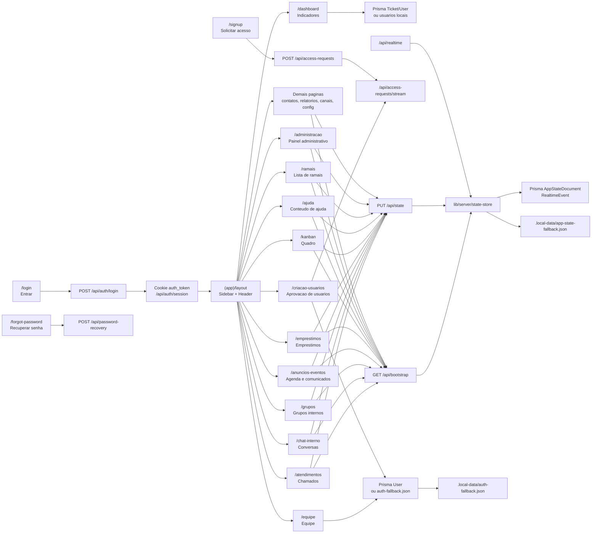

# Mapa visual do sistema

Este mapa mostra como as paginas principais se ligam hoje, usando fallback local em `.local-data` e a mesma camada pronta para persistir no Prisma/PostgreSQL quando o banco estiver disponivel.

## Resumo por pagina

| Pagina | O que faz | Fala com |
| --- | --- | --- |
| `/login` | Autentica usuario institucional | `/api/auth/login`, `User/Session` ou fallback local |
| `/signup` | Cria pedido de acesso | `/api/access-requests`, stream de pedidos |
| `/dashboard` | Mostra metricas e grafico | `Ticket/User` no Prisma ou usuarios locais |
| `/chat-interno` | Conversas, anexos, leitura, denuncias e alertas | `/api/bootstrap`, `/api/state`, `/api/realtime` |
| `/grupos` | Grupos, participantes, admins e mensagens | `/api/bootstrap`, `/api/state`, `/api/realtime` |
| `/atendimentos` | Chamados por setor, mensagens e historico | `/api/bootstrap`, `/api/state`, painel admin |
| `/anuncios-eventos` | Agenda, lembretes e comunicados | `/api/bootstrap`, `/api/state` |
| `/emprestimos` | Solicitar, aprovar, adiar e resolver emprestimos | `/api/bootstrap`, `/api/state`, painel admin |
| `/kanban` | Colunas, cards, etiquetas e prazos | `/api/bootstrap`, `/api/state` |
| `/ajuda` e `/ramais` | Consulta conteudo criado no admin | `/api/bootstrap`, `/api/state` |
| `/criacao-usuarios` | Aprova/rejeita pedidos e gerencia usuarios | Prisma `User/AccessRequest` ou `auth-fallback.json` |
| `/administracao` | Usuarios, denuncias, chamados, emprestimos, ajuda e ramais | Estado compartilhado + acoes locais |
| Paginas genericas | CRUD simples por modulo para deixar a pagina utilizavel | `AppState.pageRecords` via `/api/state` |
